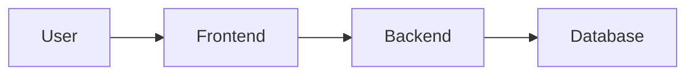

# 1. Overview

### 1.1 Purpose

**Description**

- Briefly describe the purpose and overview of the document.

### 1.2 Document Name

**Description**

- Provide the official name of the document.

### 1.3 Author

**Description**

- Include the name and organization of the person responsible for writing the document.

### 1.4 Change History

**Description**

- Record the date and key summary of changes made to the document.

**Example**

```
- 2025-01-01: Initial draft
- 2025-01-05: Added detailed requirements
```

---

# 2. MVP Goals and Key Metrics

### 2.1 Purpose

**Description**

- State the hypothesis or goals to be validated during this MVP.

**Example**

```
"Offering a 30% discount coupon after user registration will increase revisit rates within 14 days."
```

### 2.2 Key Metrics (KPI)

**Description**

- Define quantitative metrics to measure the success of the MVP.

**Example**

```
"Revisit rate within 14 days after registration to exceed 30%."
```

---

# 3. Requirements Summary

### 3.1 Functional Requirements

**Description**

- List the core functional requirements to be implemented in the project.

**Example**

```
- F1: User registration via email
- F2: Login via email
- F3: Basic main screen
```

### 3.2 Non-Functional Requirements

**Description**

- Outline non-functional requirements such as security, performance, and scalability.

**Example**

```
- NF1: Minimize security requirements (no email verification)
- NF2: Performance (support up to 1,000 daily users)
- NF3: Latency (under 3 seconds)
```

---

# 4. High-Level Architecture

### 4.1 System Overview (C4 Model – Context Level)

**Description**

- Provide a simplified diagram representing the overall system architecture. Use diagrams like C4 Context to describe system components and interactions.

**Example**



### 4.2 Tech Stack

**Description**

- List the key technologies that will be used in the project.

**Example**

```
- Frontend: React (Tailwind CSS)
- Backend: Node.js (Express)
- Database: MongoDB
- Infrastructure: AWS (EC2), GitHub Actions (CI/CD)
```

---

# 5. Design Specification

### 5.1 Screen Structure & User Flow

#### 5.1.1 Key Screens (Pages)

**Description**

- List the core screens or pages required in the MVP.

**Example**

```
- Main Page
- Registration/Login Page
- Post Creation Page
- Post Details/List Page
```

#### 5.1.2 User Flow

**Description**

- Describe how users navigate between screens and outline key user scenarios.

**Example**

```
1) User accesses the main page.  
2) Registers/logs in → Redirected to the main page after login.  
3) Views the post list → Accesses the details page → Creates a post (login required).  
(Optional) Use tools like Mermaid Sequence Diagram for visual representation.
```

---

### 5.2 Page Layout

#### 5.2.1 Main Page

**Description**

- Define the layout of each core page, including headers, content, and footers.

**Example**

```
- Header (logo, Sign up/Login button)
  - Logo: Left aligned, height 40px
  - Sign up/Login button: Right aligned, padding 8px 16px

- Main content (post list, search bar)
  - Search bar: Centered at the top, width 50%
  - Post list: Grid layout
    - Desktop: 3-column grid (24px spacing)
    - Tablet: 2-column grid
    - Mobile: 1-column grid
  - Post card:
    - Thumbnail image: 16:9 aspect ratio
    - Title: Limit to 2 lines
    - Summary: Limit to 3 lines

- Footer (basic links)
  - Height: 60px
  - Links: Left aligned, 24px spacing
```

---

### 5.3 Responsive Design Considerations

**Description**

- Document layout differences across devices (e.g., mobile vs. desktop).

**Example**

```
- Desktop: Post list in a 3-column grid; Sign up/Login button on the right.
- Mobile: Post list in a single-column layout; Fixed navigation at the top.
```

---

# 6. Feature-Level Specification

### 6.1 Feature A (e.g., User Registration)

#### 6.1.1 User Story A1

**Description**

1. Define the user story: Describe the feature in the context of user interaction.
2. UI Flow: Outline the user flow through the UI.
3. API Specification: Define API endpoints and request/response data.
4. Database Schema: Provide the database structure related to the feature.
5. Test Cases: Specify normal and error scenarios to validate the feature.

**Example**

```
1) User Story: A user can register using their email address.  
2) UI Flow:
   - Click "Sign up" → Fill out the registration form → Registration successful → Redirect to main page.  
3) API Specification:
   - POST /api/users
     - Request: { email, password }
     - Response: { userId, ... }
4) Database Schema:
   - User(id, email, password, createdAt, ...)
5) Test Cases:
   - Successful registration, duplicate email error, missing input error, etc.
```

#### 6.1.2 User Story A2

**Description**

- Repeat for additional user stories, such as optional features or variations.

---

# 7. Data Model / Schema

**Description**

- Define the database tables/collections and their fields. Mention relationships between tables/collections.

**Example**

```
Tables and Collections:
- User (User information)
- Post (Post information)

Simple MongoDB Schema Example:
  // users collection
  {
    _id: ObjectId,
    email: String,
    password: String,
    createdAt: Date
  }

  // posts collection
  {
    _id: ObjectId,
    userId: ObjectId,
    title: String,
    content: String,
    createdAt: Date
  }
```

---

# 8. API Specification

**Description**

- List each API endpoint, HTTP method, and define request/response data with a brief description.

**Example**

|Endpoint|Method|Description|Request Body/Params|Response|
|---|---|---|---|---|
|/api/users|POST|User registration|{ email, password }|{ userId, email, ... }|
|/api/users/:id|GET|Get user details|path param: userId|{ userId, email, ... }|
|/api/posts|POST|Create a post|{ title, content }|{ postId, title, ... }|
|/api/posts/:id|GET|Get post details|path param: postId|{ postId, title, ... }|
|...|...|...|...|...|

---

# 9. Deployment & Operation

### 9.1 Deployment Method

**Description**

- Describe the deployment pipeline and automation tools used.

**Example**

```
Automatic deployment via GitHub Actions to AWS EC2.
```

### 9.2 Basic Monitoring

**Description**

- Outline the monitoring setup, such as log tracking and alert mechanisms.

**Example**

```
- AWS CloudWatch for log monitoring.
- Slack notifications for error alerts.
```

---

# 10. MVP Metrics

### 10.1 Data Collection Items

**Description**

- Define the metrics and events to track for MVP evaluation.

**Example**

```
- Number of sign-up button clicks.
- Number of post creation button clicks.
- Revisit frequency within 14 days after login.
```

### 10.2 Data Collection Method

**Description**

- Explain how events will be tracked and stored.

**Example**

```
- Trigger /log/metrics API on events → Save data in the database.
```

---

# 11. Technical Debt Management (Out of Scope)

**Description**

- List items excluded from the MVP scope or simplified for this phase. Document these for future improvement.

**Example**

```
- Simplified login authentication (no OAuth)
- Limited error logging for post creation
- Enhanced security needed for production
```

---

# 12. Appendix

**Description**

- Include additional references, terminology definitions, or other supplementary materials.

**Example**

```
- Glossary of terms
- Links to reference documents
```