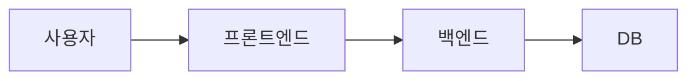

# 1. 개요 (Overview)

### 1.1 목적

**설명**

- 문서 전체의 목적과 개요를 간단히 기술합니다.

### 1.2 문서명

**설명**

- 문서의 정식 명칭을 기재합니다.

### 1.3 작성자

**설명**

- 작성자 혹은 담당자의 이름과 소속을 기재합니다.

### 1.4 변경 이력

**설명**

- 변경된 날짜와 변경된 주요 내용을 기록합니다.

**예시**

```
- 2025-01-01: 최초 작성
- 2025-01-05: 요구사항 상세 추가
```

---

# 2. MVP 목표와 핵심 지표 (MVP Goal & Metrics)

### 2.1 목적

**설명**

- 이번 MVP를 통해 검증하고자 하는 가설이나 목표를 간단히 기술합니다.

**예시**

```
"회원가입 후 30% 할인 쿠폰을 주면 14일 이내 재방문률이 증가할 것이다."
```

### 2.2 핵심 지표(KPI)

**설명**

- 위에서 제시한 목적(가설)을 평가하기 위한 정량적인 지표를 기술합니다.

**예시**

```
"회원가입 후 14일 내 재방문율 30% 이상"
```

---

# 3. 요구사항 요약 (Requirements Summary)

### 3.1 핵심 기능 요구사항 (Functional Requirements)

**설명**

- 프로젝트에서 반드시 구현되어야 하는 기능 목록을 간단히 기술합니다.

**예시**

```
- F1: 이메일로 회원가입
- F2: 이메일로 로그인
- F3: 간단한 메인 화면
```

### 3.2 비기능 요구사항 (Non Functional Requirements)

**설명**

- 보안, 성능, 확장성 등 기능 이외의 요구사항을 기술합니다.

**예시**

```
- NF1: 보안 요구사항 최소화 (이메일 인증 미적용)
- NF2: 성능 요구사항 (일 최대 1,000명 사용 가능)
- NF3: 레이턴시 (3초 이내)
```

---

# 4. 전체 아키텍처 개요 (High-level Architecture)

### 4.1 간단한 시스템 구성도 (C4 Model – Context 수준)

**설명**

- 프로젝트의 전체적인 시스템 아키텍처를 간단히 나타냅니다.
- C4 모델의 Context 다이어그램 등을 활용해, 어떤 주요 시스템이나 구성 요소가 있는지 표현합니다.

**예시**



### 4.2 기술 스택

**설명**

- 사용될 주요 기술 스택을 항목별로 정리합니다.

**예시**

```
- 프론트엔드: React (Tailwind CSS)
- 백엔드: Node.js (Express)
- 데이터베이스: MongoDB
- 인프라: AWS (EC2), GitHub Actions (CI/CD)
```

---

# 5. 디자인 스펙 (Design Specification)

MVP 단계에서 **개발에 직접 반영**될 최소한의 UI/UX 가이드를 정의합니다.

---

## 5.1 화면 구조 & 사용자 흐름 (User Flow)

### 5.1.1 주요 화면(페이지)

**설명**

- MVP에서 구현되어야 하는 핵심 화면의 종류를 기술합니다.

**예시**

```
- 메인 페이지
- 회원가입/로그인 페이지
- 게시글 작성 페이지
- 게시글 상세/목록 페이지
```

### 5.1.2 사용자 흐름

**설명**

- 사용자가 각 화면 간 어떻게 이동하는지, 주요 시나리오를 요약합니다.

**예시**

```
1) 사용자는 메인 페이지 접근  
2) 회원가입/로그인 → 로그인 성공 시 메인 페이지로 리다이렉트  
3) 게시글 목록 확인 → 상세 페이지 진입 → 게시글 작성(로그인 필요)
(선택) Mermaid Sequence Diagram 등으로 간단히 표현 가능
```

---

## 5.2 페이지 레이아웃

### 5.2.1 Main Page

**설명**

- 메인 페이지의 레이아웃(헤더, 컨텐츠, 푸터 등)을 구체적으로 정의합니다.

**예시**

```
- Header (logo, Sign up/Login button)
  - 로고: 왼쪽 정렬, 높이 40px
  - 로그인/가입 버튼: 오른쪽 정렬, 패딩 8px 16px

- Main content (post list, search bar)
  - 검색바: 상단 중앙 배치, 너비 50%
  - 게시물 목록: 그리드 레이아웃
    - PC: 3열 그리드(간격 24px)
    - 태블릿: 2열 그리드
    - 모바일: 1열 그리드
  - 게시물 카드:
    - 썸네일 이미지: 16:9 비율
    - 제목: 2줄 제한
    - 요약: 3줄 제한

- Footer (basic links)
  - 높이: 60px
  - 링크: 좌측 정렬, 간격 24px
```

> **Tip**: MVP 단계에서는 디자인 툴(Figma, Sketch) 없이도 **종이 스케치**나 간단한 레이아웃 공유로 충분합니다.

---

## 5.4 반응형 / 화면별 고려사항

**설명**

- PC와 모바일 등 서로 다른 화면 크기에 따른 배치/레이아웃 차이를 정리합니다.
- MVP 우선순위에 따라 핵심 사용자 시나리오(PC 또는 Mobile)를 중점적으로 고려합니다.

**예시**

```
- PC: 게시글 목록을 3열 그리드, 우측 로그인/회원가입 버튼
- Mobile: 1열 리스트, 상단 고정 네비게이션
```

---

# 6. 주요 기능별 설계 (Feature-Level Specification)

각 기능을 **사용자 스토리** 단위로 나누고, 필요한 API/DB 설계를 간단히 기술합니다.

---

## 6.1 기능 A (예: 회원가입)

### 6.1.1 사용자 스토리 A1

**설명**

1. 사용자 스토리: 해당 기능(회원가입)을 어떤 사용자 상황에서, 어떤 식으로 사용할지를 설명합니다.
2. UI 흐름: 기능 사용 시 사용자 인터페이스 흐름을 서술합니다.
3. API 명세: 필요한 API Endpoint, Request/Response 데이터를 정의합니다.
4. DB 스키마: 관련 DB 필드 구조를 설명합니다.
5. 테스트 케이스: 정상 시나리오와 에러 시나리오를 포함하여 정의합니다.

**예시**

```
1) 사용자 스토리: 사용자는 이메일 주소를 통해 회원가입할 수 있다.  
2) UI 흐름:
   - 회원가입 버튼 클릭 → 회원가입 폼 입력 → 가입 완료 → 메인 화면 리다이렉트  
3) API 명세:
   - POST /api/users
     - Request: { email, password }
     - Response: { userId, ... }
4) DB 스키마:
   - User(id, email, password, createdAt, ...)
5) 테스트 케이스:
   - 정상 등록, 이메일 중복 에러, 입력값 누락 시 에러 등
```

### 6.1.2 사용자 스토리 A2

**설명**

- 동일한 형식으로, 다른 세부 사용자 스토리를 정의합니다.
- 예: ‘이메일 인증 생략 시나리오’, ‘SNS 연동 회원가입’ 등이 있을 수 있습니다.

---

## 6.2 기능 B (예: 게시글 생성)

**설명**

- 기능 B에 대한 사용자 스토리, API, DB 설계, 테스트 케이스 등을 동일한 구조로 작성합니다.

---

# 7. 데이터 모델 / 스키마 (Data Model)

**설명**

- 데이터베이스 구조 또는 테이블/컬렉션 설계를 간단히 기술합니다.
- 각 테이블(또는 컬렉션)과 컬럼(또는 필드)의 관계, 자료형 등을 명시합니다.

**예시**

```
테이블 및 컬렉션:
- User (사용자 정보)
- Post (게시글 정보)

간단한 MongoDB 스키마 예시:
  // users collection
  {
    _id: ObjectId,
    email: String,
    password: String,
    createdAt: Date
  }

  // posts collection
  {
    _id: ObjectId,
    userId: ObjectId,
    title: String,
    content: String,
    createdAt: Date
  }
```

---

# 8. API 명세 (API Endpoint Spec)

**설명**

- 주요 API Endpoint마다 Method, Request Body/Params, Response, 역할을 표 형태로 정의합니다.

**예시**

|Endpoint|Method|Description|Request Body/Params|Response|
|---|---|---|---|---|
|/api/users|POST|사용자 회원가입|{ email, password }|{ userId, email, ... }|
|/api/users/:id|GET|사용자 정보 조회|path param: userId|{ userId, email, ... }|
|/api/posts|POST|게시글 등록|{ title, content }|{ postId, title, ... }|
|/api/posts/:id|GET|게시글 상세 조회|path param: postId|{ postId, title, ... }|
|...|...|...|...|...|

---

# 9. 배포 및 운영 (Deployment & Operation)

### 9.1 배포 방법

**설명**

- 프로젝트 배포 파이프라인 및 자동화 도구에 대해 서술합니다.

**예시**

```
GitHub Actions를 통해 빌드 후, AWS EC2에 자동 배포
```

### 9.2 기본 모니터링

**설명**

- 로그 확인, 에러 모니터링, 알림 방식 등에 대해 기술합니다.

**예시**

```
- AWS CloudWatch 로그 모니터링
- 에러 발생 시 Slack 알림
```

---

# 10. MVP 측정 항목 (MVP Metrics)

### 10.1 수집할 데이터 목록

**설명**

- MVP 목표 달성을 위해 추적해야 할 지표 및 이벤트를 기술합니다.

**예시**

```
- 회원가입 버튼 클릭 횟수
- 게시글 작성 버튼 클릭 횟수
- 로그인 후 14일 내 재방문 횟수
```

### 10.2 데이터 수집 방법

**설명**

- 이벤트 발생 시점, 로그 서버 혹은 DB 저장 방식 등을 설명합니다.

**예시**

```
- 이벤트 발생 시 /log/metrics API 호출 → DB 저장
```

---

# 11. 기술적 부채 관리 (Out of scope)

**설명**

- MVP 범위에서 제외되거나 간소화된 부분(보안, 에러 처리, 인증 로직 등)을 명시합니다.
- 추후 리팩토링 또는 확장을 위해 이슈로 남길 항목을 정리합니다.

**예시**

```
- 로그인 인증 로직 간소화(OAuth 미적용)
- 게시글 등록 시 에러 로깅 최소화
- 향후 운영 시 보안 강화 필요
```

---

# 12. 부록 (Appendix)

**설명**

- 추가적인 용어 정리, 참고 문서 목록 등 부록 자료를 기재합니다.

**예시**

```
- 주요 용어 정리
- 참고 문서 링크
```